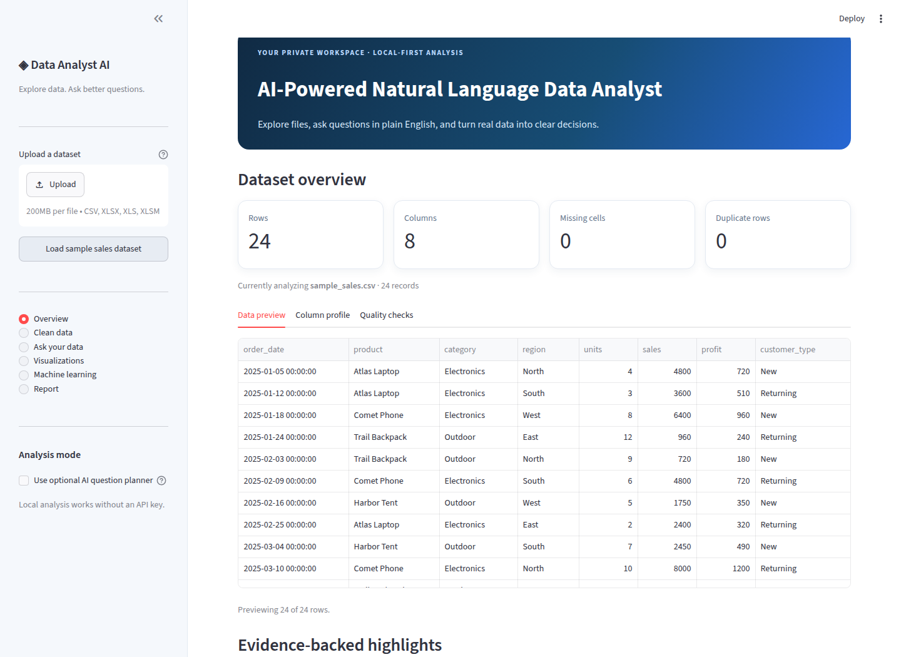
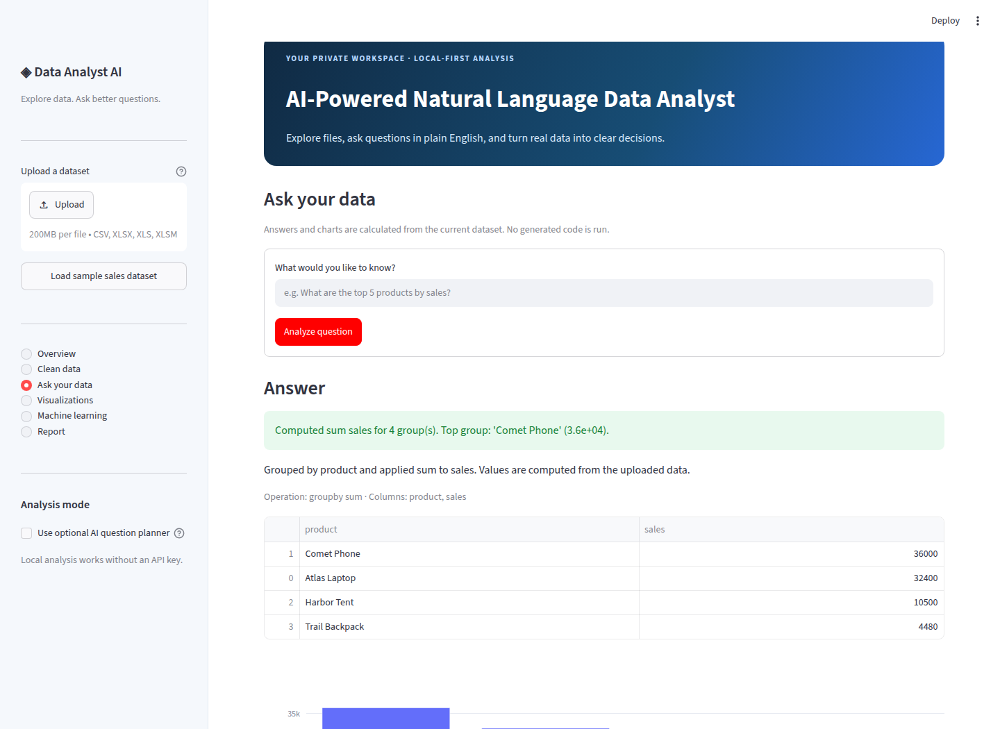
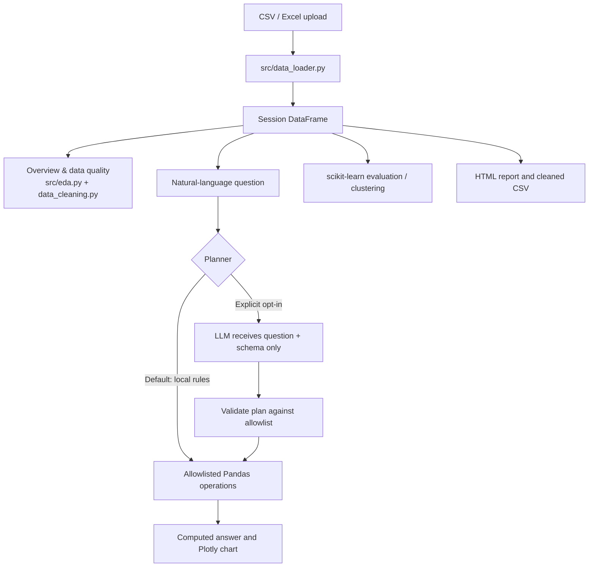

# AI-Powered Natural Language Data Analyst with Automated Insights

A portfolio-ready Streamlit application that turns uploaded CSV and Excel files into an interactive analysis workspace. Users can inspect and clean data, ask common questions in plain English, explore Plotly charts, run optional predictive models, and export a calculated HTML report—without writing Python or SQL.

> **Local-first by design:** upload, cleaning, statistics, charts, rules-based questions, machine learning, and reports run locally in the app process. No LLM is required. The optional AI question planner is off by default; if explicitly enabled, it sends only your question and column names/types to the configured OpenAI-compatible endpoint—not row values. Review your provider's data policy before enabling it.

## Problem statement

Many students and non-technical users have useful tabular data but lack the time or skills to write exploratory analysis code. This project combines a beginner-friendly dashboard with transparent calculations, safe question mapping, and carefully evaluated optional models.

## Features

- CSV and Excel uploads, preview, dtypes, missing values, duplicate counts, and configurable cleaning.
- Numeric descriptive statistics, IQR outlier checks, correlation pairs, and computed overview highlights.
- Local natural-language analysis for supported aggregations, rankings, row counts, monthly trends, correlations, and outlier scans.
- No `eval`, generated Python, or generated SQL. Every local query maps to a small set of predefined Pandas operations.
- Interactive Plotly histograms, box plots, category comparisons, correlation heatmaps, and question-driven charts. Download charts as standalone HTML.
- Optional linear-regression and logistic-classification baselines with preprocessing fitted inside a train/test pipeline; optional K-means clustering.
- Downloadable cleaned CSV and HTML analysis report containing actual computed results.
- Synthetic demo data and automated tests.

## Screenshots

These screenshots were captured from the running Streamlit application using the included synthetic demo data.

**Dataset overview**



**Natural-language answer with the computed grouped totals and chart**



## Technology

Python 3.10+ · Streamlit · pandas · NumPy · Plotly · scikit-learn · SQLite (not enabled in this version; all query calculations operate directly on the in-memory DataFrame) · optional OpenAI-compatible chat completions endpoint.

## Architecture



### Project tree

```text
ai_data_analyst/
├── app.py
├── src/
│   ├── data_loader.py
│   ├── data_cleaning.py
│   ├── eda.py
│   ├── nl_query_engine.py
│   ├── llm_planner.py
│   ├── visualization.py
│   ├── ml_engine.py
│   └── report_generator.py
├── data/sample_sales.csv
├── docs/screenshots/
│   ├── overview.png
│   └── question-answer.png
├── tests/test_core.py
├── requirements.txt
├── .env.example
├── .gitignore
└── README.md
```

## Run locally (Windows + VS Code)

1. Install Python 3.10 or newer and [VS Code](https://code.visualstudio.com/). In VS Code, install the official Python extension.
2. Download/unzip this project, then choose **File → Open Folder** and open `ai_data_analyst`.
3. Open **Terminal → New Terminal**. Create and activate an isolated environment:

   **PowerShell:**
   ```powershell
   py -m venv .venv
   .\.venv\Scripts\Activate.ps1
   python -m pip install --upgrade pip
   pip install -r requirements.txt
   ```

   If PowerShell blocks environment activation, use Command Prompt:
   ```bat
   py -m venv .venv
   .venv\Scripts\activate.bat
   python -m pip install --upgrade pip
   pip install -r requirements.txt
   ```

4. Start the application:
   ```powershell
   python -m streamlit run app.py
   ```
   Open the local URL Streamlit prints (normally `http://localhost:8501`).
5. Select **Load sample sales dataset** in the sidebar to explore immediately, or upload your own `.csv`, `.xlsx`, or `.xls` file.

### macOS / Linux

```bash
python3 -m venv .venv
source .venv/bin/activate
python -m pip install --upgrade pip
pip install -r requirements.txt
python -m streamlit run app.py
```

## Try these questions

The local planner supports a deliberately limited set of transparent operations. Try:

- `Which product has the highest sales?`
- `What is the average sales by region?`
- `Show monthly sales trend` (requires a date-like column)
- `Top 5 products by sales`
- `Are there any unusual values?`
- `Show correlations`
- `How many rows are in the dataset?`

The parser is not a general-purpose conversational model. If it cannot safely identify the operation or columns, it explains what it could not resolve rather than guessing. Use the displayed operation, columns, and calculation explanation to verify every answer.

## Optional AI question planner

The deterministic local mode works without a key and is selected by default. To use the optional planner:

1. Copy `.env.example` to `.env` in the project root.
2. Add your API key and, if needed, your provider's compatible base URL/model. **Never commit `.env`.**
3. In the sidebar, explicitly check **Use optional AI question planner**.

The API receives a JSON description of column names/types and the question; it does **not** receive dataset rows or cell values. Its response is treated as untrusted: the app parses JSON, checks the operation against an allowlist, validates exact column names and types, then performs the calculation locally. The configured endpoint/provider can still log the question/schema; review its terms and data policy. API availability, model access, and usage charges depend on your provider.

## Data handling and limitations

- CSV and Excel processing occurs in the running app session. This sample has no account system, permanent database, or multi-user isolation layer; deploy only for data you are comfortable processing in that hosting environment.
- Upload guardrails: at most 1,000,000 rows and 250 columns. Large files can still be constrained by available memory.
- The local question interpreter is intentionally limited; it does not generate arbitrary SQL/code or infer every synonym.
- Outlier flags use the conventional 1.5 × IQR rule; a flagged value is not necessarily erroneous.
- Correlation is association, not causation. Summaries and trend descriptions are descriptive, not causal.
- Regression/classification examples are simple baselines, not production forecasts. Metrics depend on the dataset, random split, and target; small or imbalanced datasets may be unsuitable.
- Clustering is exploratory and depends on chosen numeric features and cluster count.
- The provided `sample_sales.csv` is **small synthetic data created for this project**, not a real-world source dataset. It has no external dataset attribution or third-party data license.
- HTML charts use Plotly's public CDN when viewed online; an internet connection is required for interactive chart rendering in exported reports.

## Tests

Install project requirements, then run:

```bash
python -m pytest -q
```

The tests cover CSV and Excel reading, invalid uploads, data cleaning, query calculations against actual test rows, rejected unsupported plans, chart/report generation, regression/classification metrics, and clustering. Test output should be reported from your own run; metrics are not hard-coded into the documentation.

## Deploy to Streamlit Community Cloud

1. Create a GitHub repository and push the source using the commands below.
2. Sign in to [Streamlit Community Cloud](https://share.streamlit.io/) with GitHub and create a new app.
3. Select the repository, branch, and `app.py` as the main file.
4. Deploy. The included `requirements.txt` installs dependencies.
5. Leave the optional AI planner off unless you deliberately choose to configure a secret. If configuring a provider secret in Streamlit's app settings, use `OPENAI_API_KEY`, `OPENAI_BASE_URL`, and `OPENAI_MODEL`; never store credentials in the repository.

Community Cloud is a hosted environment: files uploaded there are processed on that host, not on your laptop. Do not upload private, regulated, or confidential datasets unless you have verified that hosting arrangement is appropriate. For a purely private demo, run locally instead.

## GitHub upload commands

Create an empty GitHub repository named `ai-powered-natural-language-data-analyst` first, then run in the project directory (replace `YOUR-USERNAME`):

```bash
git init
git add .
git commit -m "Build AI-powered natural language data analyst"
git branch -M main
git remote add origin https://github.com/YOUR-USERNAME/ai-powered-natural-language-data-analyst.git
git push -u origin main
```

Before pushing, check `git status` and confirm `.env`, uploaded user data, and private files are not staged.

## Viva / placement explanation

**30-second summary:** “I built a Streamlit data analyst that loads tabular files, profiles and cleans data, answers a supported set of natural-language questions through validated Pandas operations, and generates interactive charts and an HTML report. An optional AI planner is consent-gated, sends schema and question only, and cannot execute generated code. The machine-learning section uses train/test evaluation and pipelines to avoid fitting preprocessing on test data.”

**How a question is answered:** The local parser identifies a supported intent (such as mean-by-category), maps mentioned column names to actual DataFrame columns, validates types, executes a known Pandas aggregation, and returns the result plus its columns and explanation. Unsupported or ambiguous requests get a safe fallback.

**Why not `eval()`?** Generated strings could run arbitrary code. The app uses a predefined set of operations and validates every referenced column and aggregation before calculation.

**How leakage is reduced:** The target cannot be selected as an input feature, the split occurs before fitting imputers/scalers/encoders, and those transformations live inside the scikit-learn pipeline. This prevents direct target inclusion and preprocessing leakage; it cannot detect every domain-specific leakage feature automatically.

**Why use a test set?** Metrics on training data measure memorization as well as generalization. A held-out split gives a more realistic—though still imperfect—estimate on unseen rows.

**What does correlation mean?** It measures association between numeric variables, not a causal relationship. Confounding variables and chance patterns can explain correlations.

**Current trade-off:** A conservative local rule-based question engine is predictable and private, but supports fewer phrasings than a large language model. The optional planner expands intent mapping while enforcing the same local execution allowlist.

## Future improvements

- Add a robust semantic query layer with richer intent/schema matching and clearer ambiguity resolution.
- Add opt-in read-only SQL for larger datasets, with an authorizer and query timeout.
- Add date-aware seasonality analysis, confidence intervals, and explainability methods.
- Add privacy-conscious session persistence and configurable deployment authentication.
- Add PDF report output, more model baselines, classwise diagnostics, and expanded test fixtures.
